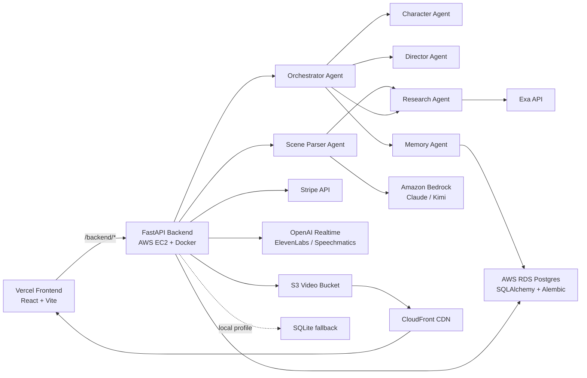

# SceneVerse AI Backend

<p>
  
</p>

FastAPI backend for SceneVerse AI, a web-first agentic movie companion that turns a paused cinematic scene into an interactive multi-agent world.

Core loop:

```text
pause video
  -> capture frame
  -> analyze scene
  -> create character agents
  -> route chat through orchestrator
  -> persist memory
  -> show agent trace to the frontend
```

This backend is built for the NEXT hackathon sponsor stack:

| Sponsor Layer | Usage In This Backend |
| --- | --- |
| AWS | EC2 Docker runtime, RDS Postgres, S3, CloudFront, Bedrock |
| Exa | Research Agent enrichment and external context |
| Stripe | Checkout Session and webhook flow for premium unlock |
| Vercel | Frontend calls this backend through `/backend/*` rewrites |

## Table Of Contents

- [Repository Links](#repository-links)
- [Hackathon Feature Highlights](#hackathon-feature-highlights)
- [Current Live Runtime](#current-live-runtime)
- [Architecture](#architecture)
- [Tech Stack](#tech-stack)
- [What The Backend Does](#what-the-backend-does)
- [Agent Responsibilities](#agent-responsibilities)
- [API Surface](#api-surface)
- [Data Model](#data-model)
- [Repository Structure](#repository-structure)
- [Local Development](#local-development)
- [Environment Variables](#environment-variables)
- [Media Flow](#media-flow)
- [Stripe Flow](#stripe-flow)
- [Database And Migrations](#database-and-migrations)
- [Testing](#testing)
- [Deployment](#deployment)
- [Production Hardening Checklist](#production-hardening-checklist)
- [Related Docs](#related-docs)

## Repository Links

SceneVerse uses a microservice-style architecture: the frontend and backend are independently deployed services connected through the `/backend/*` API boundary.

| Service | Repository | Deployment Role |
| --- | --- | --- |
| Frontend | [MikaCarapiet/agentic-vr-frontend](https://github.com/MikaCarapiet/agentic-vr-frontend) | Vercel-hosted React/Vite user interface |
| Backend | [sayyidkhan/agentic-vr-backend](https://github.com/sayyidkhan/agentic-vr-backend) | AWS-hosted FastAPI service for agents, data, media, AI, Exa, and Stripe |

Architecture boundary:

```text
frontend service -> /backend/* -> backend service
```

## Hackathon Feature Highlights

These backend features are highlighted against the NEXT hackathon manual in [docs/proposal/hackthon-info.md](docs/proposal/hackthon-info.md). The backend is built to show real agent autonomy, tool use, orchestration, and sponsor-stack integration rather than a single chatbot wrapper.

### Sponsor Stack Coverage

| Hackathon Stack | Backend Feature | Code / Config |
| --- | --- | --- |
| AWS | EC2 Docker runtime, RDS Postgres, S3/CloudFront media, Bedrock model calls | `Dockerfile`, `backend/app/config.py`, `backend/app/services/model_runtime.py`, `backend/app/services/video_storage.py` |
| Vercel | Exposes API consumed by Vercel frontend through `/backend/*` rewrite | `backend/app/main.py`, frontend `vercel.json` |
| Exa | Research Agent enrichment for character/context/collectible lookup | `backend/app/agents/research_agent.py`, `backend/app/services/exa_service.py` |
| Stripe | Checkout Session and webhook handling for premium unlock monetization | `backend/app/services/checkout.py`, `/api/checkout`, `/api/webhooks/stripe` |

### Judging Criteria Alignment

| Manual Criteria | Backend Evidence |
| --- | --- |
| Agent Overview | Implements Scene Parser, Orchestrator, Character, Director, Memory, Research, and Character Router agents. |
| Autonomy & Decision-Making | Orchestrator classifies user messages and decides whether to route to character, director, research, memory, or fallback paths. |
| Actions & Tool Use | Calls Bedrock, Exa, Stripe, OpenAI Realtime, ElevenLabs, Speechmatics, RDS Postgres, S3, CloudFront, yt-dlp, and ffmpeg-backed media flows. |
| Orchestration | Coordinates scene parsing, memory initialization, research enrichment, character/director response generation, and memory updates. |
| Human-in-the-Loop | User-triggered APIs analyze a paused frame, select/route agents, confirm checkout, and manage video catalogue data. |
| Failure Handling | Uses structured fallback scene data, simulated checkout fallback, optional external API keys, health checks, and agent trace statuses. |
| Demo & Presentation | Returns `agentTrace` arrays and structured responses so the frontend can make multi-agent work visible to judges. |

### Backend Feature Map

| Feature | What It Does | Main Files |
| --- | --- | --- |
| Scene analysis | Converts paused frame + transcript + metadata into structured scene JSON | `backend/app/agents/scene_parser.py`, `backend/app/services/scene_analysis.py` |
| Agent orchestration | Routes user questions and coordinates memory, character, director, and research paths | `backend/app/agents/orchestrator.py` |
| Character responses | Generates in-world answers with character boundaries and scene memory | `backend/app/agents/character_agent.py` |
| Director responses | Handles meta/story/cinematic explanation and consistency | `backend/app/agents/director_agent.py` |
| Memory persistence | Stores scene facts, conversation turns, summaries, and sessions | `backend/app/agents/memory_agent.py`, `backend/app/store/sqlite_store.py`, `backend/app/models/db.py` |
| Exa research | Retrieves external context and source summaries for Research Agent paths | `backend/app/agents/research_agent.py`, `backend/app/services/exa_service.py` |
| Stripe monetization | Creates Checkout Sessions and verifies webhook events | `backend/app/services/checkout.py`, `backend/app/main.py` |
| Voice transcription token | Issues OpenAI Realtime transcription tokens to the frontend | `backend/app/services/openai_realtime.py` |
| TTS output | Generates character speech through ElevenLabs or Speechmatics | `backend/app/services/elevenlabs_speech.py`, `backend/app/services/speechmatics_speech.py` |
| Video catalogue | Stores video metadata and admin updates in database | `backend/app/main.py`, `backend/app/models/db.py` |
| Media storage | Stores uploads locally or in S3 and returns CloudFront playback URLs | `backend/app/services/video_storage.py` |
| YouTube/external preparation | Downloads linked videos for capturable playback using yt-dlp | `backend/app/main.py`, `backend/Dockerfile` |
| Model registry | Lists and probes enabled Bedrock models | `backend/app/data/enabled_models.json`, `backend/app/services/model_runtime.py` |
| Health and ops | Provides health, DB health, Docker build, and CI checks | `backend/app/main.py`, `.github/workflows/backend-ci.yml` |

## Current Live Runtime

```text
Public API: http://18.207.53.115
Swagger UI: http://18.207.53.115/docs
ReDoc: http://18.207.53.115/redoc
OpenAPI JSON: http://18.207.53.115/openapi.json
Runtime: AWS EC2 + Docker
Database: AWS RDS Postgres
Media: S3 + CloudFront
```

The EC2 instance uses an Elastic IP, so the public API URL should remain stable across instance restarts.

## Architecture



## Tech Stack

| Layer | Current Choice |
| --- | --- |
| Runtime | Python 3.13 |
| API framework | FastAPI + Uvicorn |
| Data validation | Pydantic |
| ORM | SQLAlchemy 2.x |
| Migrations | Alembic |
| Cloud database | AWS RDS Postgres |
| Local fallback database | SQLite |
| Media storage | S3 + CloudFront, local fallback |
| AI runtime | Amazon Bedrock |
| Models | Claude Sonnet, Claude Haiku, Kimi through Bedrock registry |
| Agent orchestration | Custom lightweight Python agents |
| Search/research | Exa API |
| Payments | Stripe Checkout + Stripe Webhooks |
| Voice transcription | OpenAI Realtime token endpoint |
| Voice synthesis | ElevenLabs + Speechmatics |
| Video preparation | yt-dlp + ffmpeg |
| Deployment | Docker on AWS EC2 |
| Optional deploy path | AWS Lambda + Mangum |
| CI | GitHub Actions |
| Tests | pytest + httpx |

## What The Backend Does

- Accepts a paused video frame, timestamp, transcript segment, and video metadata.
- Produces scene summary, setting, emotional tone, conflict, objects, and characters.
- Creates character agents with role, personality, emotional state, goals, knowledge boundaries, and speaking style.
- Routes user messages through an Orchestrator Agent.
- Supports Director Agent, Character Agent, Memory Agent, and Research Agent flows.
- Persists scenes, characters, conversation turns, research context, character sessions, and videos.
- Stores uploaded media locally or in S3 depending on profile.
- Returns `agentTrace` arrays so the frontend can show visible multi-agent coordination.
- Supports Exa-backed research and commerce/collectible context.
- Supports Stripe Checkout for premium unlock and webhook verification.
- Supports OpenAI Realtime transcription token creation and TTS via ElevenLabs/Speechmatics.

## Agent Responsibilities

| Agent | Responsibility |
| --- | --- |
| Scene Parser Agent | Analyzes paused frame and transcript/context, creates structured scene state |
| Orchestrator Agent | Classifies user intent and routes to the right agent/tool |
| Character Agent | Responds from an in-world character perspective |
| Director Agent | Answers meta/story/cinematic questions and consistency checks |
| Memory Agent | Stores turns and maintains compact scene memory |
| Research Agent | Uses Exa for external public context when appropriate |
| Character Router Agent | Picks the best character target for voice or ambiguous prompts |

Important product rule: character agents should not use external research unless the information is plausible in-world knowledge. External context is primarily routed through the Research Agent and Director Agent.

## API Surface

### Health And Diagnostics

| Method | Endpoint | Purpose |
| --- | --- | --- |
| `GET` | `/` | Root health response |
| `GET` | `/health` | Basic app health |
| `GET` | `/health/db` | Database connectivity and schema revision |
| `GET` | `/api/db/{table_name}` | Debug table inspection |

The debug DB endpoint is useful during hackathon operations but is not production-safe without auth.

### Model And AI Runtime

| Method | Endpoint | Purpose |
| --- | --- | --- |
| `GET` | `/api/models` | List enabled model registry |
| `POST` | `/api/models/test` | Test one configured model |
| `POST` | `/api/models/test-all` | Probe all configured models |
| `POST` | `/api/bedrock/test` | Direct Bedrock probe |

### Scene And Agent Flow

| Method | Endpoint | Purpose |
| --- | --- | --- |
| `POST` | `/api/scenes/analyze` | Analyze paused frame and create scene + characters |
| `POST` | `/api/chat` | Route user message through orchestrator |
| `POST` | `/api/character/new` | Start a character session |
| `POST` | `/api/character/router` | Pick best target character |
| `POST` | `/api/character/chat` | Chat directly with a character |
| `POST` | `/api/research` | Run Exa-backed research flow |

### Video Catalogue And Admin

| Method | Endpoint | Purpose |
| --- | --- | --- |
| `GET` | `/api/videos` | List videos |
| `GET` | `/api/videos/{video_id}` | Get one video |
| `POST` | `/api/videos/link` | Add external or YouTube video reference |
| `POST` | `/api/videos/upload` | Upload media file |
| `POST` | `/api/admin/videos/{video_id}/thumbnail` | Upload/update thumbnail |
| `PATCH` | `/api/admin/videos/{video_id}` | Update video metadata |
| `DELETE` | `/api/admin/videos/{video_id}` | Delete video |
| `POST` | `/api/admin/videos/{video_id}/download` | Download/prepare linked video with yt-dlp |

Admin endpoints are MVP operations tools. Add authentication before production exposure.

### Voice And Payments

| Method | Endpoint | Purpose |
| --- | --- | --- |
| `POST` | `/api/realtime/transcription-token` | Create OpenAI Realtime transcription token |
| `GET` | `/api/speech/characters` | List configured TTS characters |
| `POST` | `/api/speech/predefined/{character}` | Generate predefined character audio |
| `POST` | `/api/speech/synthesize` | Generate TTS from supplied text |
| `POST` | `/api/checkout` | Start Stripe Checkout or simulated unlock |
| `POST` | `/api/webhooks/stripe` | Verify and handle Stripe webhook events |

## Data Model

Managed database tables:

| Table | Purpose |
| --- | --- |
| `scenes` | Generated scene context and scene-level metadata |
| `characters` | Character agents created for a scene |
| `conversation_turns` | User/agent messages and memory history |
| `research_contexts` | External context from research flows |
| `character_sessions` | Character-specific session state |
| `videos` | Catalogue records and media pointers |
| `alembic_version` | Migration/schema revision |

Current schema revision:

```text
20260610_0005
```

Cloud mode uses AWS RDS Postgres as the shared source of truth. Local mode uses SQLite only for isolated experiments.

## Repository Structure

```text
agentic-vr-backend/
  README.md                       # This backend overview and runbook
  Dockerfile                      # EC2 Docker runtime from repository root
  .github/workflows/
    backend-ci.yml                # Compile, pytest, Docker build checks
    deploy-aws-lambda.yml         # Optional/manual Lambda workflow
  backend/
    README.md                     # Deeper backend developer notes
    requirements.txt              # Runtime dependencies
    requirements-dev.txt          # Runtime + test dependencies
    pyproject.toml                # Python tool config
    Dockerfile                    # Backend-local Docker build
    Dockerfile.lambda             # Optional Lambda container image
    alembic.ini
    alembic/                      # Database migrations
    app/
      main.py                     # FastAPI routes and app wiring
      config.py                   # Environment settings
      database.py                 # SQLAlchemy engine/session setup
      lambda_handler.py           # Mangum adapter
      agents/                     # Scene, chat, memory, research agents
      models/                     # Pydantic and SQLAlchemy models
      services/                   # Bedrock, Exa, Stripe, media, voice services
      store/                      # SQLite persistence helper
      data/                       # Fallback scene, model registry, voice registry
    scripts/
      run_cloud_backend_local.sh  # Local backend against cloud RDS/S3
    tests/
      test_api_smoke.py
      test_scene_movie_cases.py
  docs/
    architecture.md
    tech-stack.md
    db/SCHEMA.md
    payments/stripe-payments-docs.md
    deployment/AWS_DEPLOYMENT_HANDOFF.md
  infra/aws/
    deploy-ec2-with-env.sh
    sync-ec2-env.sh
    deploy-lambda-zip.sh
    lambda-app.yml
```

## Local Development

### 1. Install Dependencies

```bash
cd backend
python -m venv .venv
source .venv/bin/activate
python -m pip install --upgrade pip
pip install -r requirements-dev.txt
```

### 2. Run Against Shared Cloud RDS/S3

This is the recommended backend development workflow. It runs local code while reading/writing the same RDS Postgres and S3/CloudFront media store as the deployed backend.

```bash
./scripts/run_cloud_backend_local.sh
```

The script:

- reads AWS/RDS configuration
- opens an SSH tunnel through `sceneverse-prod`
- exposes Postgres locally on `127.0.0.1:15432`
- starts FastAPI on `localhost:8000`
- configures `SCENEVERSE_PROFILE=cloud`
- keeps media storage on S3/CloudFront

Then run the frontend in local backend mode:

```bash
cd ../../agentic-vr-frontend
npm run dev:local
```

### 3. Run Against Disposable Local SQLite

Use this only when you want an isolated backend and local media files:

```bash
cd backend
SCENEVERSE_PROFILE=local uvicorn app.main:app --reload
```

Open:

```text
http://localhost:8000/docs
```

Health checks:

```bash
curl http://localhost:8000/health
curl http://localhost:8000/health/db
```

## Environment Variables

Core environment:

| Variable | Purpose |
| --- | --- |
| `APP_NAME` | Display name in health responses |
| `SCENEVERSE_PROFILE` | `local` or `cloud`; controls database/media behavior |
| `DATABASE_URL` | Active database URL |
| `LOCAL_DATABASE_URL` | SQLite URL for local mode |
| `CLOUD_DATABASE_URL` | RDS Postgres URL for cloud mode |
| `CORS_ORIGINS` | Allowed frontend origins |
| `FRONTEND_URL` | Frontend URL used by checkout redirects |

AWS and AI:

| Variable | Purpose |
| --- | --- |
| `AWS_REGION` | General AWS region |
| `BEDROCK_REGION` | Bedrock runtime region |
| `BEDROCK_MODEL_ID` | Default Bedrock model |
| `AWS_BEARER_TOKEN_BEDROCK` | Optional Bedrock bearer token for local use |
| `MODEL_REGISTRY_PATH` | Path to enabled model registry |
| `ENABLE_LIVE_SCENE_ANALYSIS` | Enables Bedrock vision analysis for `/api/scenes/analyze` |
| `SCENE_ANALYSIS_MODEL_ID` | Bedrock model used for frame analysis |
| `ENABLE_LIVE_CHARACTER_CHAT` | Enables live Bedrock character responses |
| `CHARACTER_CHAT_MODEL_ID` | Bedrock model for character chat |

Media:

| Variable | Purpose |
| --- | --- |
| `MEDIA_STORAGE_BACKEND` | `local` or `s3` |
| `MEDIA_LOCAL_DIR` | Local media directory |
| `MEDIA_PUBLIC_PATH` | Static path for local media |
| `MEDIA_STORAGE_PREFIX` | S3/local storage prefix |
| `S3_VIDEO_BUCKET` | Active S3 bucket |
| `CLOUD_S3_VIDEO_BUCKET` | S3 bucket for cloud profile |
| `MEDIA_CDN_BASE_URL` | CDN base URL for playback links |
| `CLOUD_MEDIA_CDN_BASE_URL` | CloudFront base URL for cloud profile |
| `YTDLP_COOKIES_FILE` | Optional YouTube cookies file |
| `YTDLP_USER_AGENT` | Optional yt-dlp user agent |
| `YTDLP_POT_PROVIDER_BASE_URL` | Optional PO token provider for YouTube downloads |

External APIs:

| Variable | Purpose |
| --- | --- |
| `EXA_API_KEY` | Enables Exa research/enrichment |
| `OPENAI_API_KEY` | Enables OpenAI Realtime transcription token flow |
| `OPENAI_REALTIME_TRANSCRIPTION_MODEL` | Realtime transcription model |
| `ELEVENLABS_API_KEY` | Enables ElevenLabs TTS |
| `ELEVENLABS_TTS_MODEL_ID` | ElevenLabs model ID |
| `SPEECHMATICS_API_KEY` | Enables Speechmatics TTS fallback |
| `STRIPE_SECRET_KEY` | Enables real Stripe Checkout Sessions |
| `STRIPE_WEBHOOK_SECRET` | Verifies Stripe webhooks |
| `STRIPE_CURRENCY` | Checkout currency, currently `sgd` by default |
| `STRIPE_UNLOCK_AMOUNT_CENTS` | Unlock amount in minor units |

If Stripe keys are empty, `/api/checkout` falls back to a simulated unlock URL so the core demo does not break.

## Media Flow

Upload flow:

```text
frontend uploads video
  -> FastAPI receives multipart file
  -> backend stores object locally or in S3
  -> backend writes video metadata to Postgres
  -> frontend plays CloudFront/local playback URL
```

Linked video preparation:

```text
frontend stores external/YouTube link
  -> backend stores metadata row
  -> admin/download endpoint runs yt-dlp
  -> downloaded media is stored locally or in S3
  -> playback URL is updated
```

## Stripe Flow

```text
frontend requests premium unlock
  -> POST /api/checkout
  -> backend creates Stripe Checkout Session when STRIPE_SECRET_KEY is configured
  -> user is redirected to Stripe-hosted Checkout
  -> Stripe sends POST /api/webhooks/stripe
  -> backend verifies STRIPE_WEBHOOK_SECRET
```

The payment flow is intentionally optional for demo reliability. If Stripe is not configured, the backend returns a simulated unlock path.

## Database And Migrations

Run migrations from `backend/`:

```bash
alembic upgrade head
```

The application also calls SQLAlchemy metadata creation on startup and performs small additive schema guards for MVP deploy reliability. Alembic remains the source for schema history.

Do not share `.sqlite` or `.db` files between teammates. Shared development data belongs in RDS.

## Testing

Run backend tests:

```bash
cd backend
pytest
```

Compile check:

```bash
python -m compileall app
```

Docker build checks:

```bash
docker build -f backend/Dockerfile -t sceneverse-backend:local backend
docker build --platform linux/amd64 -f backend/Dockerfile.lambda -t sceneverse-backend-lambda:local backend
```

CI runs these checks through GitHub Actions:

```text
.github/workflows/backend-ci.yml
```

## Deployment

Current live deployment path is manual CD to AWS EC2.

Deploy from the backend repository root:

```bash
./infra/aws/deploy-ec2-with-env.sh
```

The deploy script:

- syncs selected environment values
- rsyncs the working tree to EC2
- rebuilds the Docker image on EC2
- restarts the `sceneverse-backend` container
- verifies `/health` and `/health/db`

Smoke test:

```bash
curl -fsS http://18.207.53.115/health
curl -fsS http://18.207.53.115/health/db
curl -fsS http://18.207.53.115/docs > /dev/null
```

Expected SSH config:

```sshconfig
Host sceneverse-prod
  HostName 18.207.53.115
  User ec2-user
  IdentityFile ~/.ssh/sceneverse_ec2
  IdentitiesOnly yes
```

The Lambda files and workflow are retained as an optional future path, but they are not the current live runtime.

## Production Hardening Checklist

- Add authentication and authorization for admin endpoints.
- Protect or remove `/api/db/{table_name}`.
- Move from manual EC2 deploy to automated CD.
- Add HTTPS/domain hardening for Stripe production.
- Add durable user/account model for premium unlock state.
- Add rate limiting and request-size limits for frame/video endpoints.
- Add observability around model latency, Exa calls, Stripe webhooks, and media downloads.
- Consider moving from one EC2 instance to ECS/App Runner/Lambda depending on traffic and operating model.

## Related Docs

- `docs/tech-stack.md`
- `docs/architecture.md`
- `docs/db/SCHEMA.md`
- `docs/payments/stripe-payments-docs.md`
- `docs/deployment/AWS_DEPLOYMENT_HANDOFF.md`
- `backend/README.md`
