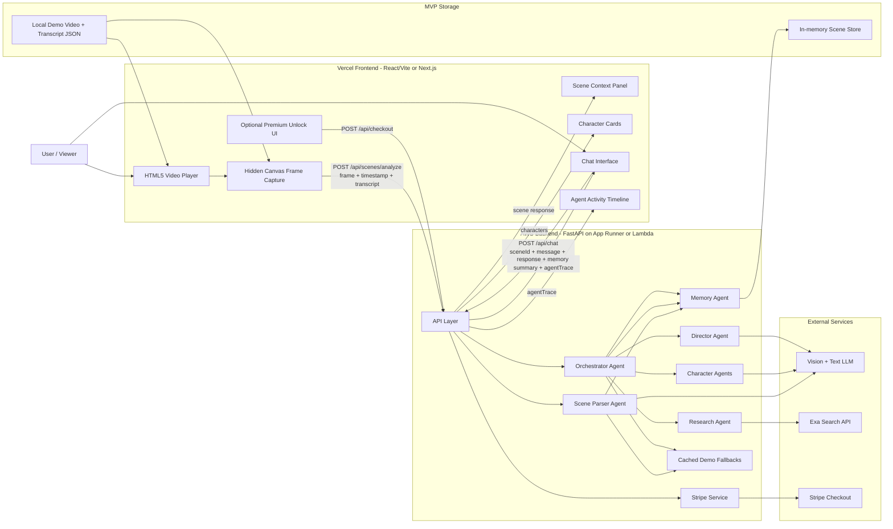
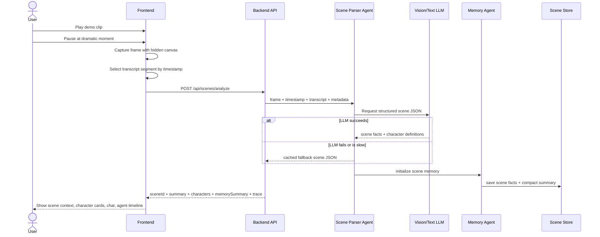
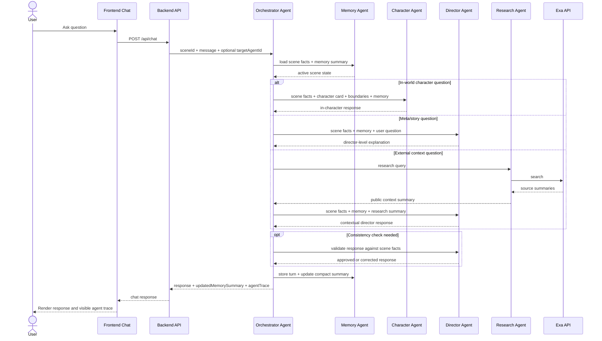
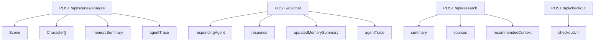

# SceneVerse AI Architecture

## Build Stance

Build this as a web-first agentic movie companion. Do not start with VR, multi-video upload, auth, marketplace, or production persistence.

The MVP should prove one loop:

```text
pause video -> capture frame -> analyze scene -> create agents -> chat with memory -> show orchestration
```

## System Architecture



## Scene Generation Flow



## Chat Orchestration Flow



## API Surface



## MVP Build Order

1. Lock one demo clip, transcript JSON, and cached fallback scene JSON.
2. Finish frontend shell: video player, pause detection, frame capture, generate button, context panel, character cards, chat panel, agent trace.
3. Implement `POST /api/scenes/analyze` with structured JSON output and fallback.
4. Implement `POST /api/chat` with orchestrator routing, character/director prompts, memory summary, and `agentTrace`.
5. Add Exa only for one clear Director Agent path.
6. Add Stripe test checkout only after the core demo loop works.

## Key Implementation Choices

- Keep character knowledge separate from Exa/public research.
- Return `agentTrace` from every backend call because visible orchestration is part of the product proof.
- Use in-memory scene state for the hackathon; move to DynamoDB after the demo.
- Keep captured frames as base64 for MVP; move to S3 only if persistence becomes necessary.
- Use App Runner for the FastAPI backend unless Lambda is required by judging criteria.
- Treat VR as a later interface layer, not the foundation of the MVP.
